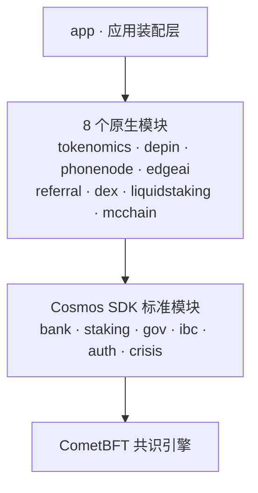

# MobileChain（MC）

> 一条把全节点装进每一部手机的公链  
> **A Public Chain That Puts a Full Node in Every Phone**

[](https://github.com/cosmos/cosmos-sdk)
[](https://github.com/cometbft/cometbft)
[](https://go.dev)
[](https://github.com/ignite/cli)
[](./LICENSE)

MC 是基于 **Cosmos SDK + CometBFT** 构建的移动优先 Layer 1 区块链，核心创新是让智能手机以「轻全节点」方式参与共识与贡献，真正实现「一部手机即一个节点」。链上经济由 8 个原生模块驱动，通证固定总量 10 亿 MC、零通胀。

**开源可审计 · 参数写代码 · 链上求真 · 共识共生**

---

## 架构



## 原生模块

| 模块 | 职责 | 关键特性 |
|------|------|---------|
| `x/tokenomics` | 代币发行与分配总账 | 唯一 Minter，固化总量 10 亿 MC，五池分配（设备激励 55% / 质押安全 15% / 团队 12% / 基金会 13% / 早期开发 5%） |
| `x/depin` | 设备贡献激励引擎 | 设备注册、贡献计量、奖励拨付闸口，DePIN 金库按真实任务逐笔发放 |
| `x/phonenode` | 移动全节点管理 | 硬件 Attestation、心跳检测、女巫绑定、离线宽限与分级罚没 |
| `x/edgeai` | 边缘 AI 任务市场 | 任务发布/接单/托管付费/乐观结算/争议仲裁，抽检验证与声誉加权遴选 |
| `x/referral` | 推荐激励 | 推荐关系链上记录，三代分级奖励，预算按配速释放 |
| `x/dex` | 原生 AMM 交易所 | 恒定乘积做市商（x×y=k），pool / swap / liquidity 与链上结算通道 |
| `x/liquidstaking` | 流动性质押 | 质押份额凭证化，汇率报价区分「空池」与「被罚没归零」 |
| `x/mcchain` | 链级参数与渐进治理 | 系统配置、查询入口、治理权限渐进移交 |

## 配套工程

| 项目 | 说明 |
|------|------|
| `mc-miner/` | Android 挖矿 App（Kotlin + Jetpack Compose） |
| `web/` | Web 控制台（矿机面板 / 交易构建） |
| `cosmjs/` | 轻量交易构建器 `mc-tx-builder.js` 与类型定义 |
| `cosmjs-bundle/` | CosmJS v0.32.4 UMD Bundle 构建源 |
| `typescript-sdk/` | TypeScript SDK（地址 / bech32 / 客户端） |
| `monitoring/` | Prometheus + Alertmanager + Grafana 配置 |
| `deploy/` | systemd unit / nginx / 环境模板与部署脚本 |
| `scripts/` | 创世生成、校验、压测、备份等运维脚本 |

## 关键参数

| 参数 | 值 |
|------|-----|
| 链 ID | `mcchain-mainnet-1` |
| 主币 | MC（最小单位 umc，1 MC = 10⁶ umc，精度 6） |
| 总量 | 10 亿 MC（10¹⁵ umc） |
| 通胀 | 零（总量永久锁定） |
| 共识 | CometBFT BFT |
| IBC | ibc-go v7.1.0 |
| 验证人最低自抵押 | 3 万 MC |

## 快速开始

```bash
# 依赖：Go 1.22+
git clone https://github.com/mcchain/mcchain.git
cd mcchain
make build           # go build ./...
make install         # 安装 mcchaind

# 本地单节点
mcchaind init mynode --chain-id mcchain-1
mcchaind keys add alice --keyring-backend test
# ... 配置创世后启动
mcchaind start
```

> 新手部署请参阅 [新手部署指南](./BEGINNER_GUIDE.md)，从零开始一键启动 MC 节点。

## 文档导航

| 文档 | 说明 |
|------|------|
| [白皮书 · 中文](./WHITEPAPER_CN.md) | MC 公链完整技术与理念阐述（中文内容的唯一来源） |
| [白皮书 · 中文印刷版 PDF](./docs/MobileChain白皮书_完整典藏版.pdf) | 典藏版，A4 排版，含目录书签 |
| [Whitepaper · English](./WHITEPAPER.md) | 英文版，与中文版逐章逐节对应 |
| [Whitepaper · Print Edition](./docs/MobileChain-Whitepaper-Collector-Edition.pdf) | 英文典藏版，A4 排版，含目录书签 |
| [通证分配](./docs/TOKEN_ALLOCATION.md) | 总量、分配池、解锁规则 |
| [协议参数总表](./docs/PROTOCOL_PARAMS.md) | 出块、经济与治理参数的唯一权威口径 |
| [模块设计](./docs/tokenomics.md) | 各原生模块的职责与链上状态 |
| [DAO 路线图](./docs/dao_roadmap.md) | 去中心化治理分阶段计划 |
| [生态文档索引](./docs/ECOSYSTEM.md) | 按角色串联全部公开资料 |
| [新手部署指南](./BEGINNER_GUIDE.md) | 一键启动教程 |
| [贡献指南](./CONTRIBUTING.md) | 代码规范与提交流程 |

## 测试

```bash
go test ./...
```

模块测试用例：depin 36 · dex 48 · edgeai 81 · liquidstaking 18 · mcchain 15 · phonenode 48 · referral 30 · tokenomics 31 · app 10 · internal 22，合计 339 项。

关键模块目标覆盖率 ≥ 70%（CI 门禁见 `.github/workflows/ci.yml`）。

## 社群

| 平台 | 链接 |
|------|------|
| Twitter / X | [@MobileChain](https://x.com/MobileChain) |
| Discord | [discord.gg/mcchain](https://discord.gg/mcchain) |
| GitHub | [github.com/mcchain/mcchain](https://github.com/mcchain/mcchain) |

## 贡献

欢迎顶级工程师与社区共同参与 MC 公链建设。参与前请阅读：

- [治理框架 GOVERNANCE.md](./GOVERNANCE.md) — 核心区/开放区、merge 权限、共识层改动流程
- [贡献指南 CONTRIBUTING.md](./CONTRIBUTING.md) — 代码规范与提交流程
- [路线图 ROADMAP.md](./ROADMAP.md) — 阶段里程碑与「Help Wanted」求援模块
- [安全政策 SECURITY.md](./SECURITY.md) — 漏洞私下披露流程
- [行为准则 CODE_OF_CONDUCT.md](./CODE_OF_CONDUCT.md)
- [贡献者协议 CONTRIBUTOR_LICENSE_AGREEMENT.md](./CONTRIBUTOR_LICENSE_AGREEMENT.md)（CLA）

## 许可证

[Apache License 2.0](./LICENSE)
