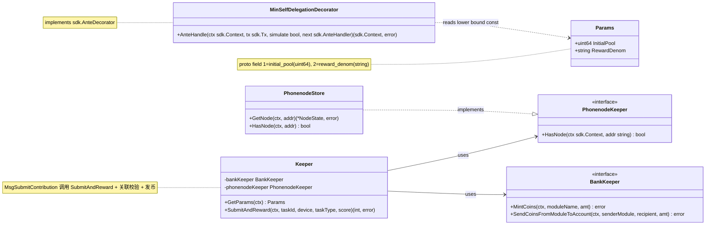
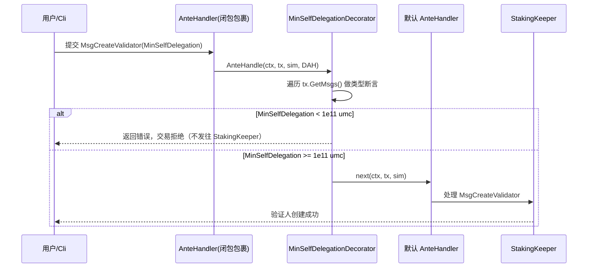
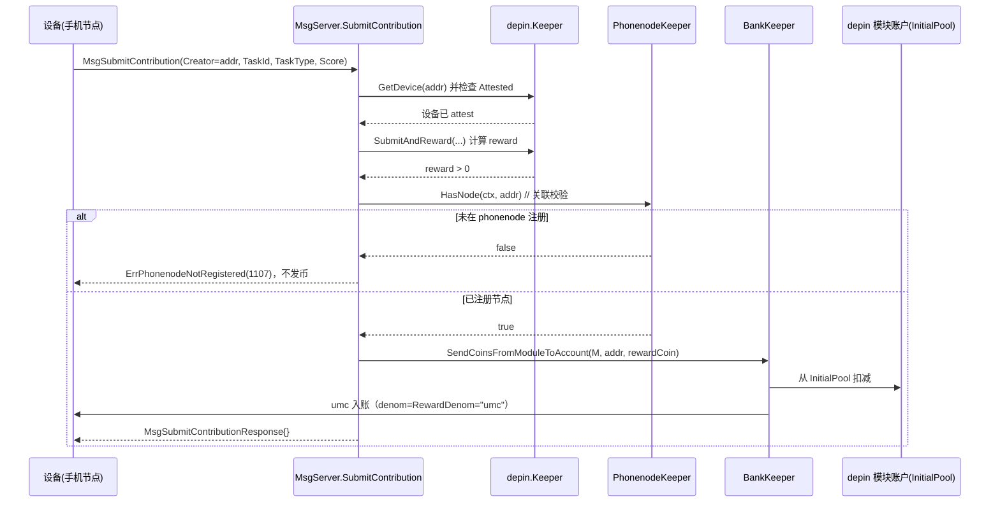
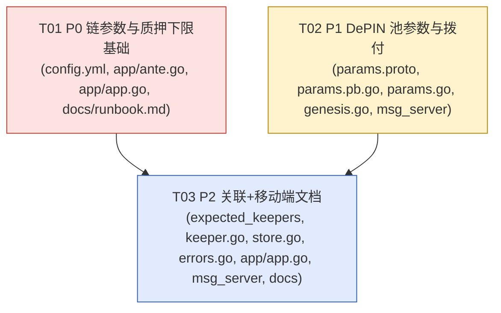

# MobileChain 增量架构设计 + 任务分解（P0 / P1 / P2）

> 文档类型：**增量架构设计**（基于已有代码 `$HOME/mcchain`，仅描述变更）
> 技术栈：Cosmos SDK v0.47.3 + cometbft v0.37.1，Ignite 脚手架；自定义模块 `x/depin`、`x/phonenode`
> 语言：简体中文
> 配套图：`docs/class-diagram.mermaid`（类/接口图）、`docs/sequence-diagram.mermaid`（时序图）

---

## Part A：系统设计

### 1. 实现方案（Implementation Approach）

本增量不引入新框架，全部基于既有 cosmos-sdk v0.47.3 能力。各 P 实现手法如下。

#### P0 — 质押经济与链参数（链要"跑得起来"）

| 难点 | 方案 |
|---|---|
| staking 默认 `BondDenom="stake"`，须与 config.yml 的 `umc` 一致 | 在 `app.go` 的 `InitChainer` 中、`app.mm.InitGenesis(...)` **之后**调用 `app.StakingKeeper.SetParams(ctx, stakingtypes.NewParams(..., "umc", ...))` 强制覆盖。放在 InitGenesis 之后，确保不被 genesis 文件里的 `stake` 覆盖（决策 Q8/约束 2）。 |
| cosmos-sdk v0.47 **无全局 MinSelfDelegation 参数**，仅每验证人字段 | 采用 **全局 ante decorator** `MinSelfDelegationDecorator`（决策 Q1/约束 1）：遍历 `tx.GetMsgs()`，对 `*stakingtypes.MsgCreateValidator` / `*stakingtypes.MsgEditValidator` 校验 `MinSelfDelegation >= 1e11 umc`，否则拒绝。 |
| 自建 ante 装饰链成本高、易错 | 不重构默认 ante 链（`ante.NewAnteHandler`）。新增 `app/ante.go`，定义 `MinSelfDelegationDecorator`（`sdk.AnteDecorator`），并在 `app.go` 用**闭包包裹**默认 handler：`app.SetAnteHandler(func(ctx,tx,sim){ return msd.AnteHandle(ctx,tx,sim, defaultHandler) })`。装饰器在请求头判断是否合法后调用 `next`。 |
| **genesis 验证人绕过 ante**（在 InitGenesis 直接创建，不经 tx） | 补充：在 `InitChainer` 中 `mm.InitGenesis` 之后，遍历 `app.StakingKeeper.GetAllValidators(ctx)`，将 `MinSelfDelegation < 1e11 umc` 的验证人强制抬到 `1e11 umc` 并 `SetValidator`。这是 ante 方案的必要补充（详见 §5 待明确 1）。 |
| 出块 3–5s | cometbft `timeout_commit`，属**运行期**配置。由 `ignite chain init` 生成 `config/config.toml` 后，将 `timeout_commit = "4s"`（写入 `docs/runbook.md` 固化步骤，不进仓库 `config.yml`）。 |
| genesis 资金远低于 100k MC | 抬高 `config.yml`：alice `coins` ≥ `100000000000umc`、validator `bonded: 100000000000umc`、其余 dev 账户保留少量（决策 Q2）。 |

#### P1 — DePIN 池拨付（submit 真能发币）

| 难点 | 方案 |
|---|---|
| `RewardDenom` 现为 `const "stake"`（dev 占位） | 改为 **param**（决策 Q4）：`Params` 增 `RewardDenom string`（默认 `"umc"`），`msg_server_submit_contribution.go` 改用 `k.Keeper.GetParams(ctx).RewardDenom`，删除 const。 |
| 需新增 `InitialPool`（uint64，umc）参数 | `params.proto` message 增 `uint64 initial_pool = 1;` 与 `string reward_denom = 2;`（字段编号 1/2 空闲，无冲突）。**沙箱无 go/protoc** → 手改 `x/depin/types/params.pb.go`（见 §5 待明确 2 + 任务 T02 提示），不依赖 protoc 重新生成。 |
| 模块账户要有钱才能发奖励 | `InitGenesis` 中 `bankKeeper.MintCoins(ctx, types.ModuleName, poolCoins)` 一次性铸入 depin 模块账户（该账户已含 `Minter` 权限，见 `maccPerms` line 198）。`InitialPool` 默认 `1e14 umc`（=1e8 MC，约 10 亿总量 10%），**运行期奖励只从池划拨，不再 mint**（决策 Q3 方案 A）。 |
| `DefaultParams` 当前返回空 | 返回 `Params{InitialPool: 1e14, RewardDenom: "umc"}`；`ParamSetPairs` 注册 `InitialPool`(uint64) 与 `RewardDenom`(string)。 |

#### P2 — 关联 + 移动端对接

| 难点 | 方案 |
|---|---|
| depin 不持有 phonenode 状态 | `expected_keepers.go` 新增 `PhonenodeKeeper` 接口 `HasNode(ctx sdk.Context, addr string) bool`；`x/phonenode/keeper/store.go` 补 `HasNode`（wrap `GetNode` 的 not-found → false）；`depin/keeper/keeper.go` 的 `NewKeeper` 注入 `phonenodeKeeper`。 |
| **接线顺序坑** | `app.go` 中 `PhonenodeKeeper` 当前在 `DepinKeeper` **之后**创建（line 555 vs 545）。P2 须把 `PhonenodeKeeper` 创建块**移到 `DepinKeeper` 之前**，再 `app.DepinKeeper = *depinmodulekeeper.NewKeeper(..., app.PhonenodeKeeper)`。 |
| 提交前须已注册节点 | `SubmitContribution` 在发币闸口（`reward>0` 分支前）调 `phonenodeKeeper.HasNode(ctx, deviceAddr)`；未注册返回 `ErrPhonenodeNotRegistered`（code 1107，`errors.go` 新增；1100–1106 已占）。关联键：`SubmitContribution.Creator`（设备地址）== phonenode 节点 `Address`（决策 Q5/Q6）。 |
| 移动端 SDK | 仅产出 `docs/mobile_sdk_integration.md`（gRPC/REST 端点清单、`umc` 约定、关键 tx/query 示例），不新建 SDK 工程（决策 Q7）。端点已由 ignite 注册，核对即可。 |

---

### 2. 文件列表（基于 `$HOME/mcchain` 根，标注 新增/修改）

**P0**
- `config.yml` —【修改】抬高 alice coins / validator bonded 至 ≥1e11 umc，denom 保持 `umc`
- `app/ante.go` —【新增】`MinSelfDelegationDecorator` 结构体 + `AnteHandle` 方法 + 下限常量 `MinSelfDelegationLowerBound = 100_000_000_000`
- `app/app.go` —【修改】`InitChainer` 增强（InitGenesis 后强制 `BondDenom="umc"` + genesis 验证人 `MinSelfDelegation` 兜底）；`SetAnteHandler` 用闭包包裹默认 handler 并插入装饰器
- `docs/runbook.md` —【新增】运行期步骤：`ignite chain init` → 设 `timeout_commit="4s"`；说明 genesis 验证人 min_self_delegation 已代码兜底

**P1**
- `proto/mcchain/depin/params.proto` —【修改】message `Params` 增 `initial_pool=1`(uint64)、`reward_denom=2`(string)
- `x/depin/types/params.pb.go` —【修改】手改：struct 增两字段；同步 `MarshalToSizedBuffer`/`Size`/`Unmarshal`（**无 protoc**）
- `x/depin/types/params.go` —【修改】`DefaultParams`、`ParamSetPairs`、参数校验
- `x/depin/genesis.go` —【修改】`InitGenesis` 中按 `InitialPool` 铸入 depin 模块账户
- `x/depin/keeper/msg_server_submit_contribution.go` —【修改】用 `params.RewardDenom` 替代 const（删 const）

**P2**
- `x/depin/types/expected_keepers.go` —【修改】新增 `PhonenodeKeeper` 接口
- `x/depin/keeper/keeper.go` —【修改】`NewKeeper` 签名注入 `phonenodeKeeper`，存为字段
- `x/phonenode/keeper/store.go` —【修改】新增 `HasNode(ctx, addr) bool`
- `x/depin/types/errors.go` —【修改】新增 `ErrPhonenodeNotRegistered`（code 1107）
- `app/app.go` —【修改】`PhonenodeKeeper` 创建块前移 + 注入 `DepinKeeper`
- `x/depin/keeper/msg_server_submit_contribution.go` —【修改】发币闸口加 phonenode 关联校验
- `docs/mobile_sdk_integration.md` —【新增】移动端 SDK 对接文档

> 说明：`x/depin/types/params.go` 与 `x/depin/genesis.go` 均涉及 `Params.InitialPool`，二者同属 P1、同任务，无冲突。

---

### 3. 数据结构与接口（Mermaid classDiagram）

要点：
- **`PhonenodeKeeper` 接口**：方法签名 `HasNode(ctx sdk.Context, addr string) bool`；仅用 sdk 类型，**不引入 phonenode 类型**，避免 `depin/types` ↔ `phonenode/types` 循环依赖。
- **`MinSelfDelegationDecorator`**：实现 `sdk.AnteDecorator`（`AnteHandle` 签名见上），下限常量 `MinSelfDelegationLowerBound = 100_000_000_000`（=1e11 umc = 100k MC）。
- **`Params` 字段编号**：`initial_pool = 1`(uint64)、`reward_denom = 2`(string)，与 `params.proto` 一致。
- **`ErrPhonenodeNotRegistered`**：`sdkerrors.Register(ModuleName, 1107, "creator not registered in phonenode")`，ModuleName=`"depin"`（keys.go line 5）。

---

### 4. 程序调用流程（Mermaid sequenceDiagram）

#### ① 用户 MsgCreateValidator 被 ante decorator 拦截校验

#### ② SubmitContribution 端到端（含 phonenode 关联校验 + 从池发 umc）

---

### 5. 待明确事项（Anything UNCLEAR）

1. **genesis 验证人 `MinSelfDelegation` 兜底（重要）**：`MsgCreateValidator` 的 ante 校验只覆盖**交易路径**；genesis 验证人（alice）由 `InitGenesis` 直接创建，不走 tx，因此 ante 装饰器**管不到**它。若 `ignite chain init` 生成的 `staking.validators[].min_self_delegation` 默认非 1e11（常见默认=1），则 genesis 验证人下限会被绕过，与 P0-1 验收 #2 冲突。本设计采用 **`InitChainer` 中 `mm.InitGenesis` 之后遍历 `GetAllValidators` 兜底抬到 1e11** 作为补充（已在 T01）。若团队更倾向"改 genesis.json 文件"，可改为运行期 `jq` 打补丁（与 timeout_commit 同列 runbook），但代码兜底最稳，推荐保留。
2. **`params.pb.go` 手改无 protoc**：沙箱无 go/protoc，只能手改 `.pb.go`。gogoproto 的 `fileDescriptor_...`（gzipped 字节）反映的是旧空 schema，**可保持不变**——Go 运行期序列化用的是生成的 `Marshal/Size/Unmarshal` 方法而非 descriptor，不影响链运行。若后续需要严格 proto 反射/第三方工具，需在用户本机用 protoc 重新生成（非必需）。字段编号 1(initial_pool,uint64,wire0) 与 2(reward_denom,string,wire2) 须与 `params.proto` 一致；`MarshalToSizedBuffer`/`Size`/`Unmarshal` 须同步新增（详见 T02 提示）。
3. **`config.yml` alice coins 是否留余量**：决策 Q2 给 alice `coins: 100000000000umc` 且 validator `bonded: 100000000000umc`（全部自质押，流动为 0）。若后续启用 tx fee，建议 alice coins 留少量余量（如 `110000000000umc`）。非阻塞，默认按 Q2。
4. **faucet 余额**：`config.yml` faucet(bob) 当前 `5umc`/`100000umc`，不在 P0 抬高范围内，保持即可（仅用于领水测试），无需改动。

---

## Part B：任务分解

### 6. 依赖包列表（Required Packages）

本增量**不引入任何新第三方依赖**。全部依赖 cosmos-sdk v0.47.3 既有能力：

- `github.com/cosmos/cosmos-sdk/types` — `sdk.AnteDecorator`、`sdk.Context`、`sdk.Coin(s)`、`sdkerrors`
- `github.com/cosmos/cosmos-sdk/x/auth/ante` — `ante.NewAnteHandler` / `ante.HandlerOptions`
- `github.com/cosmos/cosmos-sdk/x/staking/types` — `stakingtypes.MsgCreateValidator` / `MsgEditValidator` / `NewParams`
- `github.com/cosmos/cosmos-sdk/x/params/types` — `paramtypes.ParamSetPairs` / `NewParamSetPair`
- `mcchain/x/depin/types`、`mcchain/x/phonenode/types` — 既有模块类型

> 确认：无 `go.mod` 变更；`ignite chain build` 在用户本机照常解析既有依赖。

---

### 7. 任务列表（有序 + 依赖，按实现顺序）

#### T01【P0，优先级 P0】链参数与质押下限基础
- **涉及文件**：`config.yml`【改】、`app/ante.go`【新】、`app/app.go`【改】、`docs/runbook.md`【新】
- **依赖**：无（可与 T02 并行）
- **具体改动**：
  1. `config.yml`：alice `coins` 含 `100000000000umc`；`validators[0].bonded: 100000000000umc`；其余 dev 账户保留少量 `umc`；denom 统一 `umc`。
  2. `app/ante.go`（新增）：`const MinSelfDelegationLowerBound = 100_000_000_000`；定义 `MinSelfDelegationDecorator` 实现 `AnteHandle`（遍历 `tx.GetMsgs()`，对 `MsgCreateValidator`/`MsgEditValidator` 校验 `MinSelfDelegation` 下限，否则 `sdkerrors.Wrapf` 返回错误）。
  3. `app/app.go`：`SetAnteHandler` 改为闭包包裹默认 handler 并插入装饰器；`InitChainer` 中 `mm.InitGenesis` 后 (a) `app.StakingKeeper.SetParams(ctx, ...BondDenom="umc"...)`，(b) 遍历 `GetAllValidators` 将 `MinSelfDelegation < 1e11` 的抬到 `1e11` 并 `SetValidator`。
  4. `docs/runbook.md`（新增）：记录 `ignite chain init` → 改 `config/config.toml` 的 `timeout_commit="4s"` → `ignite chain start`；说明 genesis 验证人 min_self_delegation 已由代码兜底。
- **验收点**：① 用户本机 `ignite chain build` + `go test ./...` 通过；② `mcchaind q staking params` 显示 `bond_denom: umc`；③ 以 `<1e11 umc` 的 `MinSelfDelegation` 发 `MsgCreateValidator`/`MsgEditValidator` 被拒；④ `mcchaind q staking validator <addr>` 显示 `min_self_delegation: "100000000000"`；⑤ 连续 ≥20 块时间戳差中位 ∈[3s,5s]。

#### T02【P1，优先级 P1】DePIN 池参数与拨付
- **涉及文件**：`proto/mcchain/depin/params.proto`【改】、`x/depin/types/params.pb.go`【改】、`x/depin/types/params.go`【改】、`x/depin/genesis.go`【改】、`x/depin/keeper/msg_server_submit_contribution.go`【改】
- **依赖**：无（与 T01 并行）
- **具体改动**：
  1. `params.proto`：message `Params` 增 `uint64 initial_pool = 1;` 与 `string reward_denom = 2;`
  2. `params.pb.go`（手改，无 protoc）：struct 增 `InitialPool uint64` / `RewardDenom string`；同步 `MarshalToSizedBuffer`（field1 varint、field2 length-delimited string）、`Size`、`Unmarshal`（field1 wire0 uint64、field2 wire2 string）；`fileDescriptor_...` gzipped 字节可保持不变（见 §5-2）。
  3. `params.go`：`DefaultParams()` 返回 `Params{InitialPool: 1e14, RewardDenom: "umc"}`；`ParamSetPairs()` 注册 `InitialPool`(uint64)、`RewardDenom`(string) 及校验函数；`NewParams` 同步。
  4. `genesis.go`：`InitGenesis` 在 `SetParams` 之后，按 `genState.Params.InitialPool` 用 `bankKeeper.MintCoins(ctx, types.ModuleName, poolCoins)` 铸入 depin 模块账户（`poolCoins = sdk.NewCoins(sdk.NewCoin(genState.Params.RewardDenom, sdk.NewIntFromUint64(...)))`）。
  5. `msg_server_submit_contribution.go`：删除 `const RewardDenom = "stake"`，改 `denom := k.Keeper.GetParams(ctx).RewardDenom`，发币用 `denom`。
- **验收点**：① `ignite chain build` + `go test ./x/depin/...` 通过；② 链起后 depin 模块账户持有 `InitialPool=1e14 umc`；③ 注册并 attest 设备后 submit 一次有效贡献，设备 `umc` 余额增加且 denom=`umc`；④ 无 `stake` 作为奖励 denom 残留。

#### T03【P2，优先级 P2】depin↔phonenode 关联 + 移动端文档
- **涉及文件**：`x/depin/types/expected_keepers.go`【改】、`x/depin/keeper/keeper.go`【改】、`x/phonenode/keeper/store.go`【改】、`x/depin/types/errors.go`【改】、`app/app.go`【改】、`x/depin/keeper/msg_server_submit_contribution.go`【改】、`docs/mobile_sdk_integration.md`【新】
- **依赖**：`T01`（app.go 基础）、`T02`（msg_server 基础，避免同文件冲突）
- **具体改动**：
  1. `expected_keepers.go`：新增 `PhonenodeKeeper` 接口 `HasNode(ctx sdk.Context, addr string) bool`。
  2. `store.go`（phonenode）：新增 `HasNode(ctx, addr) bool`（wrap `GetNode`：err==nil 返回 true，否则 false）。
  3. `keeper.go`（depin）：`NewKeeper` 增参 `phonenodeKeeper types.PhonenodeKeeper`，存为字段。
  4. `errors.go`：新增 `ErrPhonenodeNotRegistered = sdkerrors.Register(ModuleName, 1107, "creator not registered in phonenode")`。
  5. `app/app.go`：**将 `PhonenodeKeeper` 创建块前移到 `DepinKeeper` 之前**，并 `depinmodulekeeper.NewKeeper(..., app.PhonenodeKeeper)` 注入。
  6. `msg_server_submit_contribution.go`：发币闸口（`reward>0` 分支前）调 `k.Keeper.phonenodeKeeper.HasNode(ctx, deviceAddr)`；false → 返回 `ErrPhonenodeNotRegistered`（不发币）。
  7. `docs/mobile_sdk_integration.md`（新增）：gRPC/REST 端点清单、`umc` denom 约定、`MsgRegisterNode`/`MsgRegisterDevice`/`MsgAttestDevice`/`MsgSubmitContribution` 示例、query 示例；确认端点已由 ignite 注册（核对 `module.go`）。
- **验收点**：① `ignite chain build` + `go test ./x/depin/...` 通过；② 未注册 phonenode 的设备 submit → 返回 `ErrPhonenodeNotRegistered`(1107)，不发币；③ 已注册节点的设备 submit → 正常发 `umc`；④ `docs/mobile_sdk_integration.md` 存在且含端点清单与示例。

> 任务数 = 3（≤5 上限）；每任务文件数 ≥3；T01 含配置/入口/接线（基础）；T01 与 T02 可并行，T03 依赖 T01+T02 以规避 `app.go` 与 `msg_server` 同文件编辑冲突。

---

### 8. 共享知识（Shared Knowledge，跨文件约定）

- **denom 全局统一 `umc`**：账户、自质押、DePIN 奖励、genesis 资金均用 `umc`；禁止残留 `stake`。
- **代币换算**：`1 MC = 1e6 umc`；`100k MC = 100000000000umc = 1e11 umc`；`InitialPool` 默认 `1e8 MC = 1e14 umc`。
- **`MinSelfDelegationLowerBound = 100_000_000_000`**（umc）定义在 `app/ante.go`，为 ante 与 InitChainer 兜底共用的唯一来源。
- **`RewardDenom` 默认 `"umc"`**：来自 `Params` param，非 const；`DefaultParams` 写死默认 `"umc"`。
- **错误码区间**：`1100–1106` 已占用；`1107` = `ErrPhonenodeNotRegistered`（新）；后续新增须 >1107。
- **InitialPool 铸入约定**：仅在 `InitGenesis` 经 `MintCoins` 一次性铸入 depin 模块账户，**运行期奖励只 `SendCoinsFromModuleToAccount` 从池划拨，绝不再次 mint**；depin 模块账户已含 `Minter` 权限（`app.go` maccPerms line 198）。
- **proto/pb.go 手改纪律**：`initial_pool=1`(uint64)、`reward_denom=2`(string) 字段编号必须与 `params.proto` 一致；`struct` 字段顺序与 `MarshalToSizedBuffer`/`Size`/`Unmarshal` 同步（先写高编号字段或任意顺序均可，但读/写须一致）；gzipped `fileDescriptor` 字节可不动。
- **接线顺序铁律**：`app.go` 中 `PhonenodeKeeper` 必须在 `DepinKeeper` **之前**创建并注入，否则编译期接口未满足。
- **关联键**：`SubmitContribution.Creator`（设备地址）== phonenode 节点 `Address`；校验仅在 `SubmitContribution` 发币闸口（register_device 不 gate）。

---

### 9. 任务依赖图（Mermaid graph）

---

## 工程师执行顺序（一句话）

**先并行做 T01（config.yml + ante/BondDenom 接线 + runbook）与 T02（params proto/pb.go + DefaultParams + InitGenesis 拨付 + submit 改 param），再做 T03（phonenode 接口/keeper 注入 + app.go 接线前移 + submit 关联校验 + 移动端文档），全程以用户本机 `ignite chain build` + `go test ./...` + 链上观测为验收。**
