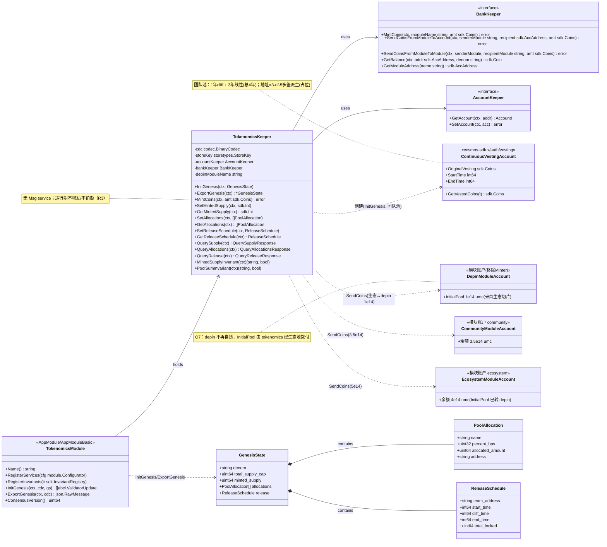
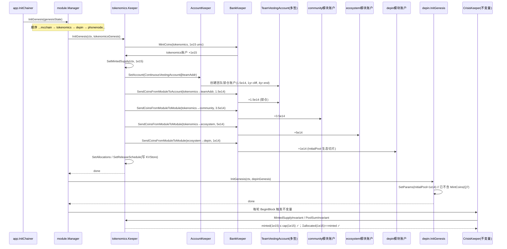
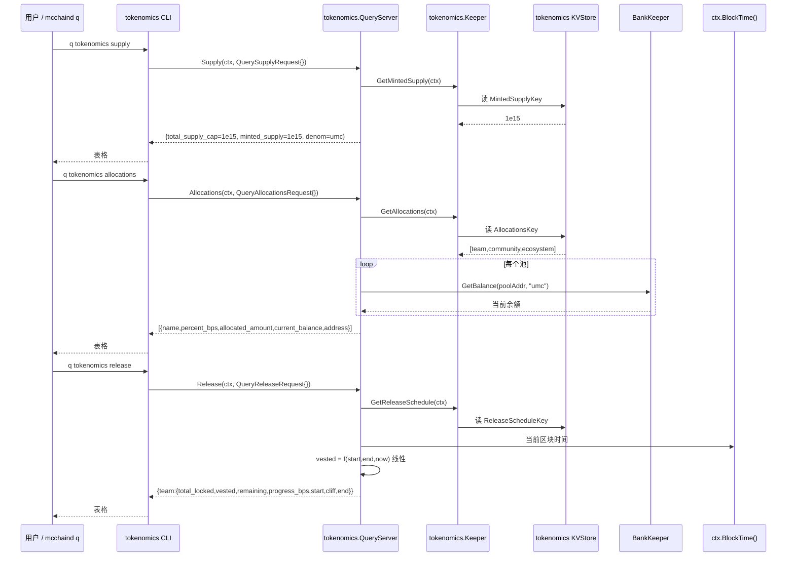
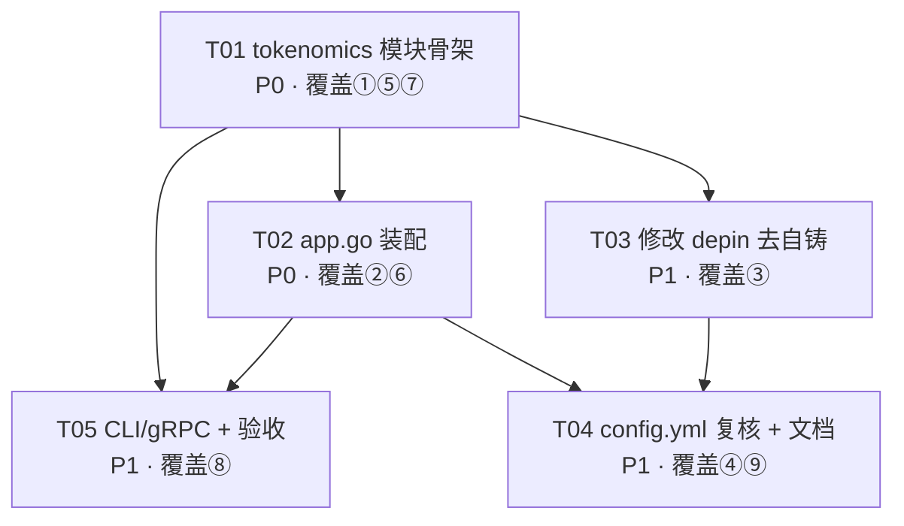

# MobileChain B1 批次 · 经济模型链上基础 · 增量系统架构设计 + 任务分解

**文档类型**：增量架构设计（基于现有 `mcchain`，仅描述变更，不含实现代码）
**批次**：B1（经济模型链上基础）— 归属路线图「阶段四 经济模型与安全」的链上部分
**作者**：高见远（Gao），Architect
**语言**：简体中文
**技术栈事实**：Cosmos SDK v0.47.3 + cometbft v0.37.1，Ignite 脚手架；`x/depin`、`x/phonenode`、`x/mcchain` 已落地。
**验收总原则**：沙箱无法运行 `go`/`protoc`。本设计不写实现代码、不执行命令；验收以用户本机 `ignite chain build` + `go test ./x/tokenomics/... ./x/depin/...` + 链上观测（`mcchaind q tokenomics ...`）为准。

> 配套图：`docs/b1_tokenomics_class-diagram.mermaid`（类/接口图）、`docs/b1_tokenomics_sequence-diagram.mermaid`（时序图）。
> 注意：未覆盖/覆盖既有 `docs/class-diagram.mermaid`、`docs/sequence-diagram.mermaid`（P0/P1 交付物，被 `docs/system_design.md` 引用），本批次改用带 `b1_tokenomics_` 前缀的专属图文件，避免破坏已有交付。

---

# Part A · 系统设计

## 1. 实现方案与框架选型

### 1.1 核心难点

| 难点 | 说明 |
|------|------|
| 总量 cap 链上不可突破 | 任何 mint（含 genesis）必须计入 `minted_supply` 且 `minted_supply ≤ total_supply_cap` 恒成立，需单一发行入口 + 链上常量 cap。 |
| depin 与 tokenomics 的 mint 权责切割（Q7） | 现有 `x/depin` 在 `InitGenesis` 自铸 `InitialPool`；必须改为「tokenomics 统一 mint，depin 不再持有 Minter」。 |
| genesis 顺序硬约束 | tokenomics `InitGenesis` 必须在 `depin` 之前，确保生态切片拨付（InitialPool）被 cap 记账覆盖。 |
| 团队池线性锁仓（Q3/Q6） | 用 `x/auth/vesting` 连续锁仓账户承载 4 年线性（含 1 年 cliff），由团队多签持有。 |
| 透明查询 + Invariant（R3） | `q tokenomics supply/allocations/release` 只读覆盖 R1/R2 全部可观测项；crisis 每轮校验 `minted≤cap` 与「池分配和==minted」。 |

### 1.2 框架与库选型

- **模块框架**：沿用 Cosmos SDK v0.47 标准模块模式（与 `x/depin`、`x/phonenode` 完全一致：`AppModule` / `AppModuleBasic` / `keeper` / `types` / `client/cli`，proto 位于 `proto/mcchain/<module>/`）。**不引入任何新第三方依赖**（详见 §6）。
- **vesting**：复用 cosmos-sdk 内置 `x/auth/vesting/types.ContinuousVestingAccount`（无需新依赖）。
- **多签地址**：复用 cosmos-sdk `crypto/multisig.NewLegacyMultisigPubKey`（无需新依赖）。
- **常量 cap**：`total_supply_cap` 作为 Go 常量 + Genesis 校验，**不进 params subspace**（Q8 锁定不可治理），故 tokenomics **不需要 params subspace**（详见 §2 文件列表与 §8 共享知识）。
- **查询**：gRPC `Query` service（proto 生成 `query.pb.go`），CLI 经 `AppModuleBasic.GetQueryCmd` 自动挂到 `mcchaind q tokenomics`。

### 1.3 架构模式

- 新增 `x/tokenomics` 作为「发行与分配总账（issuance & allocation ledger）」：唯一持 `Minter` 的模块；depin 作为「生态池使用方」。
- tokenomics 仅含 **Genesis + Query + Invariant**，**无 Msg service**（只读、运行期不增发/不销毁，满足 R3）。
- 三大池地址：团队=多签 vesting 账户；社区=`community` 模块账户（Q5）；生态=`ecosystem` 模块账户。

---

## 2. 文件列表及相对路径

### 2.1 新增 `x/tokenomics/...`

| 文件 | 类型 | 说明 |
|------|------|------|
| `proto/mcchain/tokenomics/genesis.proto` | 新增 | `GenesisState` / `PoolAllocation` / `ReleaseSchedule` 消息定义 |
| `proto/mcchain/tokenomics/query.proto` | 新增 | `Query` service：`Supply` / `Allocations` / `Release` |
| `x/tokenomics/types/keys.go` | 新增 | `ModuleName`/`StoreKey`/池名常量/`TotalSupplyCap`/`DefaultDenom`/KV key/多签占位 pubkey |
| `x/tokenomics/types/genesis.go` | 新增 | `DefaultGenesis()` / `Validate()` |
| `x/tokenomics/types/expected_keepers.go` | 新增 | `AccountKeeper` / `BankKeeper` 接口（最小表面） |
| `x/tokenomics/types/codec.go` | 新增 | `RegisterCodec` / `RegisterInterfaces`（无 Msg，仅保留接口注册） |
| `x/tokenomics/types/errors.go` | 新增 | 模块错误码 |
| `x/tokenomics/types/genesis.pb.go` | 生成 | ignite 由 proto 生成 |
| `x/tokenomics/types/query.pb.go` | 生成 | ignite 由 proto 生成 |
| `x/tokenomics/types/query.pb.gw.go` | 生成 | ignite 由 proto 生成 |
| `x/tokenomics/keeper/keeper.go` | 新增 | `Keeper` 结构 / `NewKeeper` / `Logger` / `MintCoins` |
| `x/tokenomics/keeper/store.go` | 新增 | `Get/Set MintedSupply` / `Allocations` / `ReleaseSchedule` |
| `x/tokenomics/keeper/query.go` | 新增 | `QueryServer`：`Supply` / `Allocations` / `Release` |
| `x/tokenomics/keeper/invariant.go` | 新增 | `MintedSupplyInvariant` / `PoolSumInvariant` |
| `x/tokenomics/keeper/vesting.go` | 新增 | 创建团队 vesting 账户 + 计算已释放额度（InitGenesis 与 Release 查询共用） |
| `x/tokenomics/genesis.go` | 新增 | 包级 `InitGenesis` / `ExportGenesis`（调用 keeper） |
| `x/tokenomics/module.go` | 新增 | `AppModule` / `AppModuleBasic` / `RegisterServices` / `RegisterInvariants` / `InitGenesis` / `ExportGenesis` / `ConsensusVersion` |
| `x/tokenomics/module_simulation.go` | 新增 | 最小化仿真占位（无 Msg，仅满足 `AppModuleSimulation` 接口，保持与脚手架一致） |
| `x/tokenomics/client/cli/query.go` | 新增 | `GetQueryCmd` 根命令 |
| `x/tokenomics/client/cli/query_supply.go` | 新增 | `mcchaind q tokenomics supply` |
| `x/tokenomics/client/cli/query_allocations.go` | 新增 | `mcchaind q tokenomics allocations` |
| `x/tokenomics/client/cli/query_release.go` | 新增 | `mcchaind q tokenomics release` |

### 2.2 修改既有文件

| 文件 | 变更类型 | 关键变更 |
|------|----------|----------|
| `app/app.go` | 改 | ①`ModuleBasics` 增加 `tokenomicsmodule.AppModuleBasic{}`；②`maccPerms`：**移除 depin 的 `Minter`**，新增 `tokenomics:{Minter}`、`community:nil`、`ecosystem:nil`；③`keys` 增加 `tokenomicsmoduletypes.StoreKey`；④`App` 结构增加 `TokenomicsKeeper`；⑤`New()` 中创建 `TokenomicsKeeper`（依赖 `AccountKeeper`/`BankKeeper`/`depin` 模块名）；⑥`mm` 模块列表、`SetOrderBeginBlockers`/`EndBlockers`/`InitGenesis` 中 **tokenomics 排在 depin 之前**；⑦`RegisterInvariants` 经 `app.mm.RegisterInvariants(app.CrisisKeeper)` 自动覆盖（tokenomics `RegisterInvariants` 注册两条不变量）。**不再新增 tokenomics params subspace**（cap 为常量，见 §8）。 |
| `x/depin/genesis.go` | 改 | 删除 `k.MintCoins(...)` 自铸逻辑；仅 `SetParams`。生态切片由 tokenomics 在 `InitGenesis` 经 `ecosystem→depin` 拨付（Q7）。 |
| `x/depin/keeper/keeper.go` | 改 | 删除 `MintCoins` 方法（关闭 depin 自铸路径，与权限移除一致）。 |
| `x/depin/types/expected_keepers.go` | 改 | 从 `BankKeeper` 接口移除 `MintCoins`（depin 不再需要）。 |
| `config.yml` | 复核（基本不变） | 用户/验证人账户维持现状；三大池拨付由 tokenomics `InitGenesis` 程序化完成，**无需在 config.yml 增加币分配**（理由见 §5 待明确事项 #3）。可增补注释说明。 |
| `docs/runbook.md` | 改 | 增补：tokenomics 模块上线后 `ignite chain init` 的 genesis 顺序校验、`q tokenomics` 验收步骤。 |
| `docs/tokenomics.md` | 新增 | 经济模型说明（总量、分配占比、释放曲线、查询方式），供社区与 SDK 引用（R3 文档化）。 |

---

## 3. 数据结构与接口（类图）

> 完整 mermaid 源见 `docs/b1_tokenomics_class-diagram.mermaid`，下图为正交摘要。

**核心常量（tokenomics/types/keys.go）**
```go
const (
    ModuleName        = "tokenomics"
    StoreKey          = ModuleName
    CommunityPoolName = "community"   // Q5 独立社区模块账户
    EcosystemPoolName = "ecosystem"   // 生态池模块账户
    DefaultDenom      = "umc"
    TotalSupplyCap    = uint64(1e15)  // 1e9 MC，链上常量（Q8 不可治理）
    TeamMultisigThreshold = 3         // 3-of-5，Q6 由架构师定稿（占位）
)
// percent_bps 默认：团队 1500 / 社区 3500 / 生态 5000（Q2，sum=10000）
```

**Proto Schema（GenesisState / Query）**
```proto
// genesis.proto
message GenesisState {
  string denom = 1;            // "umc"
  uint64 total_supply_cap = 2; // 1e15（InitGenesis 校验 == TotalSupplyCap 常量）
  uint64 minted_supply = 3;    // 由 InitGenesis 写入（genesis 实际拨付总额）
  repeated PoolAllocation allocations = 4;
  ReleaseSchedule release = 5;
}
message PoolAllocation {
  string name = 1;             // "team" | "community" | "ecosystem"
  uint32 percent_bps = 2;      // 1500/3500/5000
  uint64 allocated_amount = 3; // = percent_bps * cap / 10000
  string address = 4;          // 池地址（团队=多签vesting地址；其余=模块账户地址）
}
message ReleaseSchedule {
  string team_address = 1;
  int64 start_time = 2;        // = genesis + 1yr（cliff 结束，线性开始）
  int64 cliff_time = 3;        // = genesis + 1yr
  int64 end_time = 4;          // = genesis + 4yr
  uint64 total_locked = 5;     // = 团队分配额
}
// query.proto
service Query {
  rpc Supply(QuerySupplyRequest) returns (QuerySupplyResponse);
  rpc Allocations(QueryAllocationsRequest) returns (QueryAllocationsResponse);
  rpc Release(QueryReleaseRequest) returns (QueryReleaseResponse);
}
message QuerySupplyResponse { uint64 total_supply_cap=1; uint64 minted_supply=2; string denom=3; }
message PoolView { string name=1; uint32 percent_bps=2; uint64 allocated_amount=3; uint64 current_balance=4; string address=5; }
message QueryAllocationsResponse { repeated PoolView allocations=1; }
message TeamRelease { string address=1; uint64 total_locked=2; uint64 vested=3; uint64 remaining=4; uint64 progress_bps=5; int64 start_time=6; int64 cliff_time=7; int64 end_time=8; }
message QueryReleaseResponse { TeamRelease team=1; }
```

**类图（mermaid）**


---

## 4. 程序调用流程（时序图）

> 完整 mermaid 源见 `docs/b1_tokenomics_sequence-diagram.mermaid`。

### 4.1 Genesis 统一拨付顺序（tokenomics 在 depin 之前）

关键点：tokenomics `InitGenesis` 一次性 `MintCoins` 总额为 `cap`，依次拨付团队 vesting / community / ecosystem，再由 ecosystem 把 `InitialPool`(1e14 umc) 切片转给 depin 模块账户；随后 depin `InitGenesis` 仅 `SetParams`，不再自铸；最后 crisis 校验不变量。



### 4.2 查询流程（supply / allocations / release，全部只读）



---

## 5. 待明确事项（仅真正需澄清/后续批次定稿）

以下为设计阶段无法自行闭环、需用户/PM 定稿的点（其余 Q1–Q9 均已按锁定决策采用，不再追问）：

1. **团队多签真实 pubkey / 地址 / 阈值**：本设计以「3-of-5 占位 secp256k1 测试 pubkey」派生团队 vesting 地址（定义于 `x/tokenomics/types/keys.go` 常量），**主网 genesis export 前必须由团队替换为真实多签公钥**。架构已留接口，替换仅改常量。
2. **「各池余额之和 == minted_supply」不变量语义（PRD R3 疑似不严谨）**：运行期社区/生态会从各自池对外拨付，导致**实时 bank 余额之和 < minted_supply**。故本设计将不变量实现为「**链上记录的各池 allocated_amount 之和 == minted_supply**」（会计口径，恒真），而非实时余额。建议 PM 将 R3 文案改为「分配记账和 == 已发行」，以免验收误解。**→ 需回 PM 澄清。**
3. **config.yml 是否需增加三大池账户/币**：本设计判定**不需要**（拨付由 tokenomics `InitGenesis` 程序化 mint + 转账完成，config.yml 仅管用户/验证人账户）。这与 PRD 任务清单④「config.yml 增加团队/社区/生态账户与拨付」表述不同。**→ 需向 PM 确认采用本设计的 genesis 参数化方案（推荐）还是坚持 config.yml 账户。**（见 §8 共享知识）
4. **社区/生态池释放曲线**：Q3 仅团队池锁仓；本设计默认社区/生态为**立即可用（无 vesting）**，Release 查询仅对团队池返回曲线，社区/生态标注「非锁仓」。若 PM 希望社区/生态也有时间表，需补充定义。**→ 待 PM 确认。**
5. **「4 年线性含 1 年 cliff」建模口径**：本设计用 `ContinuousVestingAccount(start=genesis+1yr, end=genesis+4yr)`，即第 1 年 cliff（0 释放）、第 2–4 年线性。如 PM意图是「1 年 cliff + 4 年线性（总 5 年）」，需调整 end。**→ 待 PM 确认口径。**

---

# Part B · 任务分解

## 6. 依赖包列表

| 包 | 版本 | 是否新增 | 用途 |
|----|------|----------|------|
| `github.com/cosmos/cosmos-sdk` | v0.47.3 | 否（已有） | 模块框架、`x/auth/vesting`、`x/auth` AccountKeeper、`crypto/multisig`、`bank` |
| `github.com/cometbft/cometbft` | v0.37.1 | 否（已有） | ABCI 类型 |
| `google.golang.org/grpc` / `grpc-gateway` | 现有 | 否 | gRPC Query + REST 网关（由 ignite 生成） |

**结论：本批次预计无需新增任何第三方依赖。** vesting、multisig、bank 全部来自 cosmos-sdk 既有依赖。

## 7. 任务列表（有序、含依赖、优先级；覆盖 PRD ①–⑨）

> 任务按实现顺序排列。每个任务标注其覆盖的 PRD 点（①模块骨架 ②app.go装配 ③改depin去自铸 ④config.yml ⑤vesting账户 ⑥community账户 ⑦Invariant ⑧CLI/gRPC ⑨文档）。

| Task | 名称 | 覆盖 PRD 点 | 依赖 | 优先级 | 涉及文件（摘要） |
|------|------|-------------|------|--------|------------------|
| **T01** | 新增 `x/tokenomics` 模块骨架（proto/types/keeper/module/genesis/query/invariant/vesting） | ① ⑤ ⑦ ⑧(gRPC) | 无 | **P0** | `proto/mcchain/tokenomics/{genesis,query}.proto`、`x/tokenomics/types/*`、`x/tokenomics/keeper/{keeper,store,query,invariant,vesting}.go`、`x/tokenomics/{genesis,module,module_simulation}.go`、`x/tokenomics/client/cli/query*.go`、生成 `*.pb.go` |
| **T02** | `app/app.go` 装配（maccPerms 调整 + storekey + keeper + mm/Begin/End/InitGenesis 顺序 + RegisterInvariants） | ② ⑥ | T01 | **P0** | `app/app.go`（ModuleBasics、maccPerms、keys、App 字段、New()、mm 列表、SetOrder*、RegisterInvariants） |
| **T03** | 修改 `x/depin` 去掉自铸（genesis/keeper/expected_keepers） | ③ | T01 | P1 | `x/depin/genesis.go`、`x/depin/keeper/keeper.go`、`x/depin/types/expected_keepers.go` |
| **T04** | `config.yml` 复核 + 经济模型文档 + runbook 更新 | ④ ⑨ | T01,T02,T03 | P1 | `config.yml`（复核/注释）、`docs/tokenomics.md`（新增）、`docs/runbook.md`（改） |
| **T05** | CLI/gRPC 查询端点收尾与集成验收 | ⑧(CLI) | T01,T02 | P1 | `x/tokenomics/client/cli/query*.go`、验收：`ignite chain build` + `go test` + `mcchaind q tokenomics {supply,allocations,release}` |

**P0 验收锚点**：T01+T02 完成后，`ignite chain build` 通过、`mcchaind q tokenomics supply` 返回 `total_supply_cap=1e15`、`minted_supply=1e15`（=genesis 拨付总额）、`depin` 模块账户含 1e14 umc 且不再持有 Minter；crisis 不变量在启动后若干高度不因 `minted>cap` 或「池和≠minted」而 halt。

**T03 验收锚点**：depin `InitGenesis` 不再调用 `MintCoins`；`app/app.go` maccPerms 中 `depin` 仅 `{Burner, Staking}`；`go test ./x/depin/...` 通过且 depin 模块账户余额仍 = 1e14 umc（由 tokenomics 拨付）。

**T05 验收锚点**：三条子命令均返回结构化字段；`allocations` 三池占比 1500/3500/5000、余额与分配一致；`release` 团队池返回 vested/remaining/progress% 且随区块时间推进而增长。

## 8. 共享知识（跨文件约定）

- **denom 与单位**：`denom="umc"`；`1 MC = 1e6 umc`；总量 `1e9 MC = 1e15 umc`。所有链上金额以 `umc` 整数表达。
- **常量 `TotalSupplyCap = 1e15`**（tokenomics/types/keys.go）：作为 Go 常量 + Genesis 校验双保险，**不进 params subspace、不纳入治理**（Q8）。任何 mint 前必须先 `minted_supply + amt ≤ cap`，否则 panic。
- **池地址约定**：
  - 团队池 = 3-of-5 多签派生的 `ContinuousVestingAccount` 地址（占位，见 §5 #1）。
  - 社区池 = `authtypes.NewModuleAddress("community")`（Q5 独立模块账户）。
  - 生态池 = `authtypes.NewModuleAddress("ecosystem")`；生态池持有 `5e14 umc`，其中 `1e14 umc` 在 genesis 转给 depin 模块账户（InitialPool 切片，Q4/Q7）。
  - 分配占比（`percent_bps`）默认 1500/3500/5000，Genesis `Validate` 必须 `sum==10000`。
- **genesis 顺序硬约束**：`tokenomics.InitGenesis` **必须排在 `depin.InitGenesis` 之前**（在 `SetOrderInitGenesis` 中 tokenomics 位于 mcchain 之后、depin 之前）。理由：生态切片拨付（InitialPool）与 cap 记账由 tokenomics 完成，depin 仅消费已到账资金。
- **depin 权限调整（硬约束）**：`maccPerms` 中 **depin 移除 `Minter`**，改为 `{Burner, Staking}`；统一由 `tokenomics` 持有 `Minter`。未来任何增发必须经由 tokenomics 并累加 `minted_supply` + 过 cap 校验，不得另起不受 cap 约束的 mint。
- **`minted_supply` 语义**：tokenomics 有史以来累计 mint 量（genesis 一次性 = cap），只增不减；持久化于 tokenomics KVStore，重启一致。
- **释放进度缓存（Q9）**：tokenomics KVStore 仅缓存**释放曲线元数据**（`ReleaseSchedule`：start/cliff/end/total_locked）；查询时的「已释放额度」由元数据 + `ctx.BlockTime()` **实时计算**（查询不改状态）。即「曲线元数据缓存、进度实时算」，既避免每次跨模块读 vesting 账户，又保持只读。
- **不变量（crisis 每轮校验）**：
  - `MintedSupplyInvariant`：`minted_supply ≤ total_supply_cap`（恒真，genesis 即 =cap）。
  - `PoolSumInvariant`：`Σ allocations[].allocated_amount == minted_supply`（会计口径，见 §5 #2）。
- **无运行期 Msg**：tokenomics 不注册 `MsgServer`，不改状态、不增发/不销毁（R3）。

## 9. 任务依赖图



---

## 附：B1 是否需回 PM 澄清的要点（给主理人）

1. **R3 不变量文案需修正**：「各池余额之和 == minted_supply」应改为「**分配记账和 == 已发行**」，否则运行期拨付后实时余额和不成立。→ 建议回 PM（许清楚）澄清/改 PRD。
2. **config.yml 实际无需加三大池币**：拨付由 tokenomics `InitGenesis` 程序化完成，与 PRD 任务④字面对齐有出入，采用 genesis 参数化（推荐）。→ 建议与 PM 确认口径。
3. **社区/生态是否也有释放曲线**：当前仅团队池 vesting；若社区/生态也需时间表，需补充定义。→ 待 PM 确认。
4. **「4 年含 1 年 cliff」建模口径**：本设计取「1 年 cliff + 3 年线性（总 4 年）」；若意图为「1+4=5 年」需调整。→ 待 PM 确认。
5. 团队多签真实密钥为占位，主网前替换（架构已留接口）。
