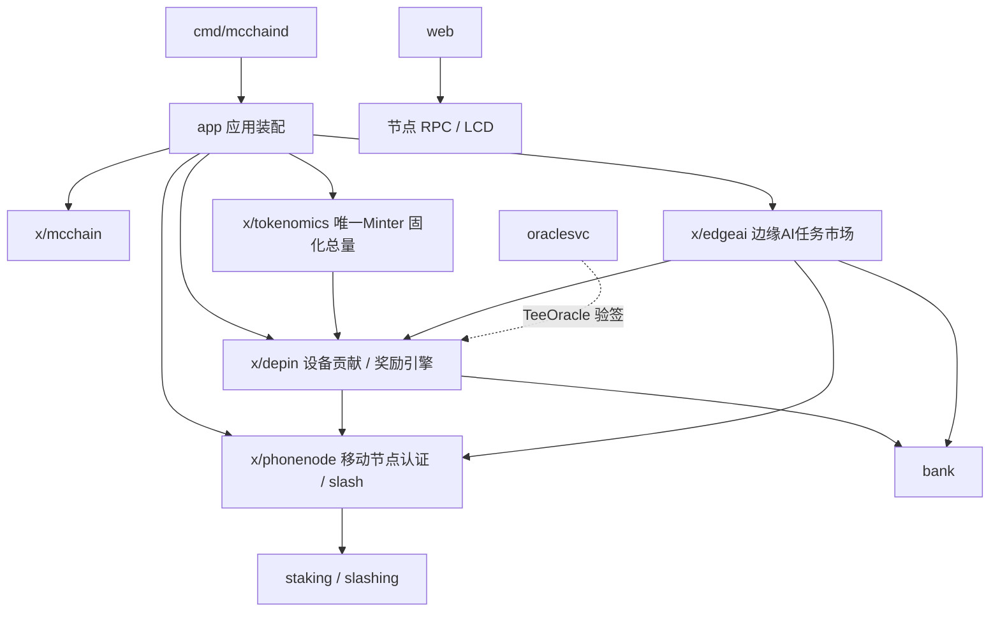

# MC 公链（MobileChain）

面向「手机即节点」的 DePIN + 边缘 AI 贡献激励公链，基于 **Cosmos SDK v0.47 + Ignite** 构建。
底座复用 Cosmos SDK 标准模块，业务差异化由 5 个自定义模块承载，经济闭环为：

`tokenomics（唯一铸币 / 固化总量）→ depin（设备贡献奖励）→ phonenode（移动节点认证 / slash 闸口）→ edgeai（任务市场 / 贡献即挖矿拨付）`

## 架构概览



## 模块清单（18 个自有代码模块）

| 模块 | 职责 |
|------|------|
| `x/mcchain` | 系统参数 / 查询占位模块 |
| `x/tokenomics` | 代币发行与分配总账，唯一持 Minter，固化总量 1B MC |
| `x/depin` | DePIN 设备注册 / 认证 / 贡献 / 奖励引擎 / 发币闸口 |
| `x/phonenode` | 移动全节点注册 / 硬件 attestation / 心跳 / 离线 slash |
| `x/edgeai` | 边缘 AI 任务市场：创建 / 提交 / 争议仲裁 / 贡献即挖矿拨付 |
| `app` | App 装配 / AnteHandler / 预言机切换 / 创世兜底 / export |
| `cmd/mcchaind` | 节点守护进程 + CLI |
| `cmd/oracle` + `internal/oraclesvc` | 链下预言机签名服务 |
| `cmd/event-subscriber` | 链下业务事件订阅器 |
| `web` | 区块链仪表盘（链概览 / 钱包 / 区块浏览器） |
| `proto` / `docs` / `testutil` / `tools` / `scripts` / `deploy` / `monitoring` | 协议 / 文档 / 测试 / 工具 / 运维 / 部署 / 监控 |

## 快速开始

```bash
# 依赖：Go 1.22.5（本项目固定在 D 盘，见 DEVELOPMENT.md）
make build          # 或 go build ./...
make install        # 安装 mcchaind

# 本地单节点（开发）
mcchaind init mynode --chain-id mcchain-1
mcchaind keys add alice
mcchaind gentx ... && mcchaind collect-gentxs
mcchaind start
```

> 注意：Ignite 的 `ignite chain serve` 与 `ignite generate proto-go` 在本项目 Windows 沙箱环境中不可用，
> 协议代码需**手动 protoc 生成**（步骤见 [DEVELOPMENT.md](./DEVELOPMENT.md)）。

## 文档导航

- [模块系统梳理与完成度白皮书](./docs/MODULE_WHITEPAPER.md) — 全量模块总览、完成度、改进路线图
- [系统设计](./docs/system_design.md) / [审计](./docs/audit.md) / [安全](./docs/security.md)
- [预言机框架](./docs/ORACLE_FRAMEWORK.md) / [移动 SDK 集成](./docs/mobile_sdk_integration.md)
- [主网部署计划](./docs/MAINNET_DEPLOY_PLAN.md) / [主网 Runbook](./docs/MAINNET_RUNBOOK.md)
- [开发环境搭建](./DEVELOPMENT.md)

## 测试

```bash
go test ./...
```

自定义模块测试覆盖：depin（14）、phonenode（7）、tokenomics（~7）、edgeai（17）、app（6）、mcchain（5）。
关键模块目标覆盖率 ≥ 70%（CI 门禁见 `.github/workflows/ci.yml`）。
